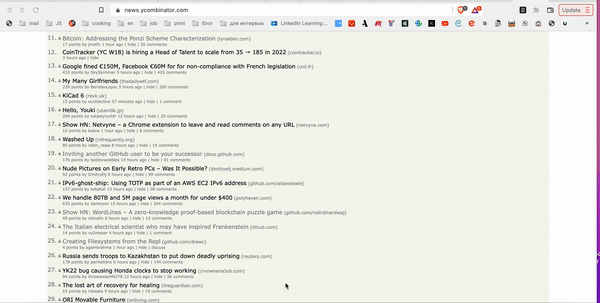

# Shortened-URL
URL shortening is a technique on the internet in which a URL may be made substantially shorter and still direct to the required page.

# Example

## Prerequisites

The necessary dependencies are specified in the file requirements.txt

## Installing

To run the project you need to:
1. clone the repository
2. install the necessary libraries
3. create .env file and put the way to your postgres database (ex. DATABASE_URL=)
4. If you would like to run this project localy you need to put number of the port as well. (ex. PORT=8080)

# License

This project is licensed under the [CC0 1.0 Universal](LICENSE.md)
Creative Commons License - see the [LICENSE.md](LICENSE.md) file for
details
